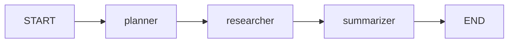

# LangGraph Research Assistant

A simple research assistant built with LangGraph that demonstrates core concepts for building stateful AI workflows.

## What This Project Demonstrates

This project showcases the following LangGraph concepts:

| Concept | Implementation |
|---------|---------------|
| **State Management** | `ResearchState` TypedDict defining shared state |
| **Node Functions** | `planner_node`, `researcher_node`, `summarizer_node` |
| **Graph Construction** | `StateGraph` with nodes and edges |
| **Conditional Edges** | `should_continue` function for dynamic routing |
| **Graph Compilation** | `workflow.compile()` for execution |
| **Visualization** | `get_graph().draw_mermaid()` for diagram generation |

## Graph Structure

```
START → planner → researcher → summarizer → END
```



## Setup

### 1. Create Virtual Environment

```bash
python -m venv venv
source venv/bin/activate  # On Windows: venv\Scripts\activate
```

### 2. Install Dependencies

```bash
pip install -r requirements.txt
```

### 3. Configure Environment Variables

```bash
cp .env.example .env
# Edit .env and add your Hugging Face token
# Get your token at: https://huggingface.co/settings/tokens
```

### 4. Run the Assistant

```bash
python research_agent.py
```

## Usage

1. Run the script
2. Enter a research topic when prompted
3. Watch the agent progress through each step:
   - **Planner**: Generates 3 key research questions
   - **Researcher**: Answers each question
   - **Summarizer**: Creates a final report
4. View the final research report

## Code Structure Explained

### State Definition (Lines 30-45)

```python
class ResearchState(TypedDict):
    topic: str           # Input from user
    questions: List[str] # Generated by planner
    answers: List[str]   # Generated by researcher
    final_report: str    # Generated by summarizer
    current_step: str    # Tracks progress
```

The state flows through the entire graph, with each node reading and updating it.

### Node Functions (Lines 55-150)

Each node follows this pattern:
1. Read from state
2. Process (call LLM)
3. Return state updates

```python
def planner_node(state: ResearchState) -> dict:
    topic = state["topic"]       # Read
    questions = llm.invoke(...)  # Process
    return {"questions": questions}  # Update
```

### Graph Construction (Lines 175-210)

```python
workflow = StateGraph(ResearchState)
workflow.add_node("planner", planner_node)
workflow.add_edge(START, "planner")
workflow.add_conditional_edges("planner", should_continue, {...})
graph = workflow.compile()
```

### Conditional Edges (Lines 155-170)

```python
def should_continue(state: ResearchState) -> str:
    if state["current_step"] == "planning_complete":
        return "researcher"
    elif state["current_step"] == "research_complete":
        return "summarizer"
    return END
```

## Key Interview Talking Points

1. **Why LangGraph?**
   - Manages complex AI workflows with state
   - Provides clear structure for multi-step processes
   - Enables conditional logic and cycles (loops)

2. **State Management**
   - TypedDict provides type safety
   - State is immutable - nodes return updates
   - Shared across all nodes

3. **Graph vs Chain**
   - Chains are linear (A → B → C)
   - Graphs allow branching and cycles
   - Better for complex workflows

4. **Compilation**
   - Validates graph structure
   - Optimizes execution
   - Produces runnable object

## Extending This Project

Ideas for enhancement:
- Add a "fact_checker" node
- Implement web search with tools
- Add human-in-the-loop approval
- Create parallel research branches
- Add memory/persistence

## License

MIT
